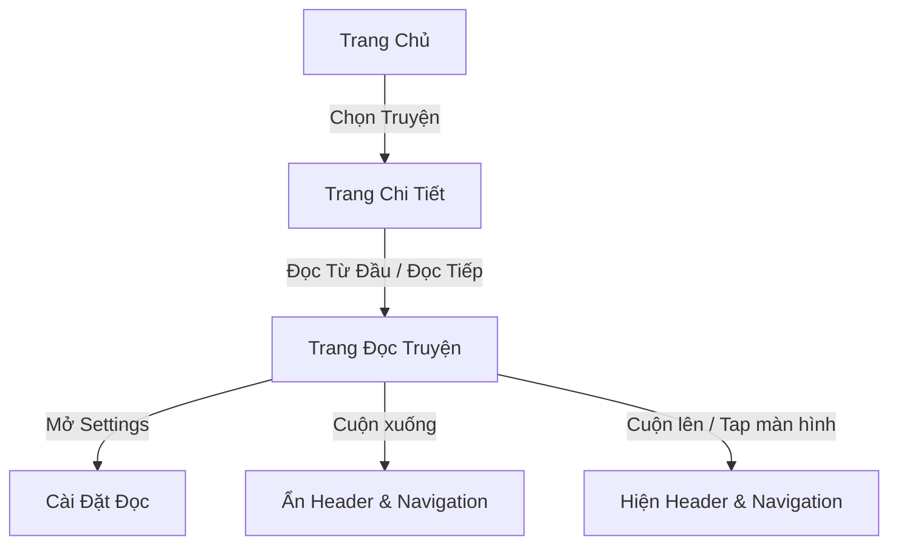
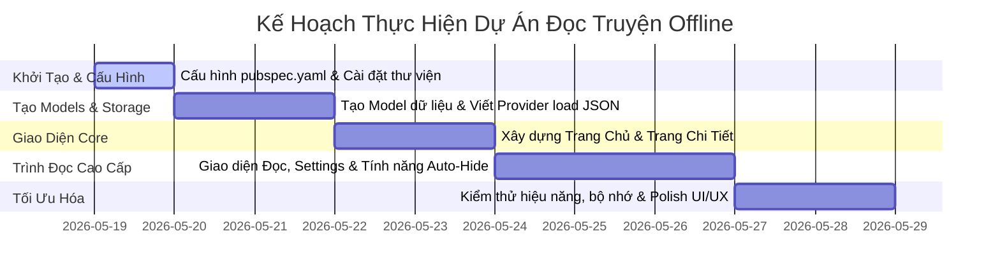

# KẾ HOẠCH PHÁT TRIỂN ỨNG DỤNG ĐỌC TRUYỆN: CUSTOM TRUYỆN

Dự án này là một ứng dụng đọc truyện offline được viết bằng **Flutter**. Ứng dụng đọc dữ liệu trực tiếp từ file JSON nội bộ (`assets/data/output.json`), hỗ trợ lưu lịch sử đọc (chương hiện tại, % tiến trình) và lưu các cấu hình giao diện đọc (cỡ chữ, màu nền, khoảng cách dòng, chủ đề tối mặc định).

Tài liệu này vạch ra kế hoạch chi tiết, kiến trúc mã nguồn và các bước thực hiện để xây dựng ứng dụng với trải nghiệm người dùng cao cấp, mượt mà và trực quan.

---

## 🗺️ Tóm tắt Dự án & Tính năng Core



### 1. Nguồn Dữ Liệu

- Sử dụng file `assets/data/output.json` có sẵn trong thư mục dự án.
- Đọc và parse dữ liệu bất đồng bộ bằng `rootBundle` của Flutter.

### 2. Lưu Trữ Cục Bộ (Local Storage)

- Sử dụng thư viện `shared_preferences` để lưu:
  - **Lịch sử đọc**: Mỗi truyện lưu `chapId` (ID chương đang đọc) và `progress` (phần trăm đã đọc, tính theo tỷ lệ cuộn màn hình `scrollOffset / maxScrollExtent`).
  - **Settings cấu hình đọc**:
    - Màu nền (Mặc định: Tối/Đen huyền obsidian).
    - Màu chữ (Mặc định: Xám sáng/Trắng ngà).
    - Cỡ chữ (Mặc định: `18.0` - có thể tăng/giảm từ `12.0` đến `30.0`).
    - Khoảng cách dòng (`lineHeight` mặc định `1.6`, tùy chọn `1.2`, `1.5`, `1.8`, `2.0`).

### 3. Thiết Kế Các Trang (UI/UX Premium)

- **Trang chủ**: Danh sách truyện trực quan. Sử dụng Logo mặc định từ `assets/image/logo` làm ảnh đại diện cho truyện, kèm thông tin tiến trình dạng thanh Progress Bar tinh tế (ví dụ: `Đang đọc: Chương 12 / 1464 (0.8%)`).
- **Trang chi tiết truyện**:
  - Hiển thị bìa truyện lớn (làm mờ làm nền dạng Glassmorphism), tên truyện, tổng số chương.
  - Trạng thái đọc: Hiển thị nút **"Đọc Tiếp"** nổi bật (nếu có lịch sử) hoặc **"Đọc Từ Đầu"**.
  - Danh sách chương phân trang: Hỗ trợ chia trang **100 chương/page** dưới dạng một thanh TabBar trượt ngang hoặc Dropdown chọn nhanh cực kỳ tiện lợi để tránh giật lag khi tải danh sách hàng nghìn chương.
- **Trang đọc chương truyện**:
  - Tải nội dung truyện mượt mà.
  - Hiển thị tiêu đề chương và thanh Breadcrumb điều hướng (`Trang chủ > Tên Truyện > Chương X`).
  - Hệ thống nút "Chương Trước", "Chương Sau", và "Danh Sách Chương".
  - **Tính năng Auto-Hide cao cấp**: Khi người dùng cuộn (scroll) xuống để đọc tiếp, toàn bộ các thanh công cụ (Header, Breadcrumb, Navigation Bar) sẽ tự động trượt ẩn đi để tối ưu không gian đọc. Khi cuộn nhẹ lên hoặc chạm (tap) vào màn hình, các thanh công cụ này sẽ trượt hiện lại mượt mà với animation.

---

## 🛠️ Kiến Trúc Hệ Thống & Cài Đặt Thư Viện

### 1. Các Thư Viện Cần Thiết (`pubspec.yaml`)

Để đảm bảo ứng dụng vận hành mượt mà và quản lý state sạch sẽ, chúng ta sẽ sử dụng các thư viện sau:

```yaml
dependencies:
  flutter:
    sdk: flutter
  cupertino_icons: ^1.0.8

  # Quản lý State tập trung cho ứng dụng
  provider: ^6.1.2

  # Lưu trữ cài đặt và lịch sử đọc
  shared_preferences: ^2.2.3
```

> [!IMPORTANT]
> Do thư mục tài nguyên của bạn được đặt tên là `assets` (chữ `s` ở giữa), chúng ta cần cấu hình chính xác trong file `pubspec.yaml` để tránh lỗi `AssetNotFoundException`:
>
> ```yaml
> flutter:
>   uses-material-design: true
>   assets:
>     - assets/data/output.json
>     - assets/image/
> ```

### 2. Cấu Trúc Thư Mục Khuyến Nghị (Clean Architecture)

Chúng ta sẽ tổ chức mã nguồn trong thư mục `lib/` theo cấu trúc mô-đun hóa dễ bảo trì:

```text
lib/
├── main.dart
├── models/
│   ├── truyen_model.dart          # Định nghĩa cấu trúc Truyện
│   ├── chap_model.dart            # Định nghĩa cấu trúc Chương
│   ├── reading_history.dart       # Lịch sử đọc (chapId, progress%)
│   └── reader_settings.dart       # Cấu hình giao diện đọc (fontSize, bgColor...)
├── providers/
│   ├── novel_provider.dart        # Quản lý danh sách truyện và đọc dữ liệu JSON
│   └── reader_provider.dart       # Quản lý settings & lịch sử đọc (Shared Preferences)
├── views/
│   ├── home/
│   │   └── home_page.dart         # Giao diện Trang Chủ
│   ├── detail/
│   │   ├── detail_page.dart       # Giao diện Trang Chi Tiết
│   │   └── widgets/
│   │       └── chapter_list_tab.dart # Component danh sách chương (Phân 100 chương/page)
│   └── reader/
│       ├── reader_page.dart       # Giao diện Trang Đọc Chương
│       └── widgets/
│           ├── reader_settings_sheet.dart # Sheet cài đặt font/color
│           └── reader_header_footer.dart  # Thanh công cụ Header/Footer điều hướng
└── utils/
    ├── app_theme.dart             # Cấu hình Theme mặc định (Dark Mode)
    └── constants.dart             # Chứa đường dẫn assets, key lưu trữ local
```

---

## 📐 Chi Tiết Thiết Kế Model & Quản Lý State

### 1. Thiết Kế Các Models (`lib/models/`)

#### a. `chap_model.dart`

Khớp chính xác với cấu trúc trong file JSON của bạn:

```dart
class ChapModel {
  final int id;
  final String ten;
  final String noiDung;

  ChapModel({required this.id, required this.ten, required this.noiDung});

  factory ChapModel.fromJson(Map<String, dynamic> json) {
    return ChapModel(
      id: json['id'] as int,
      ten: json['ten'] as String,
      noiDung: json['noi_dung'] as String,
    );
  }
}
```

#### b. `truyen_model.dart`

```dart
import 'chap_model.dart';

class TruyenModel {
  final String ten;
  final String id;
  final List<ChapModel> chapList;

  TruyenModel({required this.ten, required this.id, required this.chapList});

  factory TruyenModel.fromJson(Map<String, dynamic> json) {
    var list = json['chap'] as List;
    List<ChapModel> chaps = list.map((i) => ChapModel.fromJson(i)).toList();

    return TruyenModel(
      ten: json['ten'] as String,
      id: json['id'] as String,
      chapList: chaps,
    );
  }

  // Tổng số chương dựa vào id chương cuối cùng hoặc độ dài danh sách
  int get totalChapters => chapList.isNotEmpty ? chapList.last.id : 0;
}
```

#### c. `reader_settings.dart`

Chứa các cài đặt hiển thị của trình đọc truyện:

```dart
import 'package:flutter/material.dart';

class ReaderSettings {
  double fontSize;
  double lineHeight;
  Color backgroundColor;
  Color textColor;

  ReaderSettings({
    this.fontSize = 18.0,
    this.lineHeight = 1.6,
    required this.backgroundColor,
    required this.textColor,
  });

  // Giao diện tối mặc định (Obsidian Black)
  static ReaderSettings darkDefault() {
    return ReaderSettings(
      fontSize: 18.0,
      lineHeight: 1.6,
      backgroundColor: const Color(0xFF121212),
      textColor: const Color(0xFFE0E0E0),
    );
  }
}
```

---

## 📱 Thiết Kế Chi Tiết Từng Giao Diện (UI Screens)

### 🚀 Giao Diện 1: Trang Chủ (Home Page)

- **Bố cục**: Sử dụng một `CustomScrollView` với `SliverAppBar` cuộn mượt.
- **Danh sách truyện**: GridView hoặc ListView hiển thị dạng Card bo góc sang trọng.
- **Mỗi Card truyện gồm**:
  - Ảnh mặc định (lấy từ `assets/image/logo`, thiết kế một hiệu ứng shadow bo viền lịch lãm).
  - Tên truyện (Chữ đậm, Max 2 dòng để giữ bố cục cân xứng).
  - **Tiến trình đọc**: Hiển thị text `Chương đã đọc / Tổng số chương` kèm thanh ProgressBar phần trăm màu gradient neon sáng mịn trên nền tối.

```text
+--------------------------------------+
|           CUSTOM TRUYỆN              |
+--------------------------------------+
|  +--------+  Ta có một thân bị...    |
|  |  LOGO  |  Đang đọc: Chap 1460/1464 |
|  |  TRUYỆN|  [======--------] 99.7%  |
|  +--------+                          |
+--------------------------------------+
```

---

### 📖 Giao Diện 2: Trang Chi Tiết Truyện (Book Detail Page)

- **Bố Cục Header**: Ảnh logo phóng to làm mờ phía sau (Glassmorphism), đè lên là Logo chính sắc nét, tên truyện cỡ chữ lớn và nút Action Bar.
- **Trạng Thái & Nút Điều Hướng**:
  - Dựa vào lịch sử đã lưu, hiển thị tiến độ: `Chương đang đọc: X / Chương cuối: Y`.
  - Hàng nút hành động:
    - **Đọc tiếp**: Chỉ hiển thị nếu đã có lịch sử đọc. Nhấp vào sẽ bay thẳng tới chương đang đọc và phục hồi phần trăm tiến trình cũ.
    - **Đọc từ đầu**: Tải chương đầu tiên của danh sách.
- **Danh sách chương phân trang (Pagination - 100 chương/page)**:
  - Vì số lượng chương rất lớn (hơn 1400 chương), việc hiển thị toàn bộ lên màn hình cùng lúc sẽ gây đơ lag máy.
  - **Giải pháp**: Xây dựng một thanh trượt chọn trang chương (`Page 1: 1-100`, `Page 2: 101-200`, ..., `Page 15: 1401-1464`) và chỉ render danh sách 100 chương tương ứng của trang được chọn.

---

### 🕶️ Giao Diện 3: Trang Đọc Chương (Reader Page)

Đây là giao diện cốt lõi đòi hỏi trải nghiệm tối giản và cực kỳ mượt mà.

#### A. Tính năng Tự động Ẩn/Hiện Công Cụ (Auto-Hide Navigation)

Sử dụng `ScrollController` để giám sát chuyển động cuộn của ngón tay người dùng:

1. Khi **cuộn xuống (scroll down)**: Ẩn thanh Breadcrumb, Header, Footer (nút Next/Back, danh sách chương) bằng hiệu ứng chuyển động `AnimatedSlide` hoặc `AnimatedOpacity` co rút tinh tế, trả lại không gian tối đa để đọc truyện.
2. Khi **cuộn ngược lên (scroll up)** hoặc **chạm nhẹ (tap) vào vùng trống**: Hiện lại toàn bộ các thanh công cụ để người dùng thực hiện thao tác chuyển chương hoặc thoát ra ngoài.

```dart
// Code mẫu kiểm soát Ẩn/Hiện thanh công cụ khi cuộn
void _scrollListener() {
  if (_scrollController.position.userScrollDirection == ScrollDirection.reverse) {
    if (_isToolbarVisible) {
      setState(() => _isToolbarVisible = false);
    }
  } else if (_scrollController.position.userScrollDirection == ScrollDirection.forward) {
    if (!_isToolbarVisible) {
      setState(() => _isToolbarVisible = true);
    }
  }
}
```

#### B. Trình bày Nội Dung Đọc & Settings

- **Breadcrumb**: Hiển thị tinh giản ở phần trên cùng: `Trang chủ > Ta có một thân... > Chương 1460`.
- **Cài đặt cá nhân hóa**: Một nút hình bánh răng ⚙️ ở Header/Footer khi nhấn sẽ hiển thị **Bottom Sheet** tùy chỉnh:
  - _Màu nền & chữ_: Cung cấp 4 chủ đề (Tối Obsidian, Sáng Trắng, Vàng Sách Cổ, Xám Nhạt). Mặc định luôn là **Tối**.
  - _Cỡ chữ_: Nút tăng/giảm font chữ A- và A+.
  - _Khoảng cách dòng_: Tùy chọn dãn dòng để mắt không bị mỏi khi đọc lâu.
- **Lưu % Tiến Trình Tự Động**:
  - Khi người dùng cuộn đến vị trí bất kỳ, hệ thống sẽ tính toán `% tiến trình` = `currentScroll / maxScroll`.
  - Lưu trữ vào `shared_preferences` định kỳ (hoặc khi người dùng nhấn back/thoát trang). Khi họ quay lại chương này, ứng dụng sẽ tự động cuộn (jump to) đúng vị trí % cũ.

---

## 📈 Kế Hoạch Triển Khai (Roadmap)

Dự án này sẽ được thực hiện qua **5 bước tuần tự**:



### 📅 Bước 1: Khởi Tạo & Cấu Hình Môi Trường (Ngày 1)

- Cấu hình lại file `pubspec.yaml` để khai báo các thư viện `provider`, `shared_preferences`.
- Cấu hình thư mục tài nguyên đặc thù `assets/data/output.json` và `assets/image/logo` trong `pubspec.yaml`.
- Tạo cấu trúc thư mục tiêu chuẩn trong thư mục `lib/`.

### 📅 Bước 2: Thiết Lập Models & Data Providers (Ngày 2-3)

- Viết các class Models (`TruyenModel`, `ChapModel`).
- Xây dựng `NovelProvider` để đọc dữ liệu từ file JSON nội bộ bằng `rootBundle.loadString('assets/data/output.json')`, parse JSON và lưu trữ vào bộ nhớ RAM.
- Xây dựng `ReaderProvider` quản lý lịch sử đọc và cấu hình settings cá nhân hóa bằng `SharedPreferences`.

### 📅 Bước 3: Phát Triển Trang Chủ & Chi Tiết Truyện (Ngày 4-5)

- Thiết kế Trang Chủ: Hiển thị danh sách các truyện từ JSON, kèm thông tin chương đang đọc lấy từ lịch sử lưu trữ cục bộ.
- Thiết kế Trang Chi Tiết:
  - Thiết kế Header lộng lẫy với phong cách Glassmorphism.
  - Xây dựng lô-gích nút "Đọc Tiếp" và "Đọc Từ Đầu".
  - Triển khai giải pháp phân trang danh sách chương (100 chương/page) sử dụng `DefaultTabController` hoặc `DropdownButton` để có hiệu năng mượt mà nhất.

### 📅 Bước 4: Xây Dựng Trình Đọc Chương Cao Cấp (Ngày 6-8)

- Xây dựng trang đọc chương dạng cuộn dọc mượt mà.
- Tích hợp tính năng **Auto-Hide Header/Footer** dựa trên hướng cuộn màn hình của người dùng.
- Phát triển bảng điều khiển **Reader Settings Sheet** (Bottom Sheet) để người dùng thay đổi: Cỡ chữ, Màu nền, Giãn dòng.
- Triển khai tính năng tự động ghi nhận và khôi phục `% tiến trình đọc` của chương truyện.

### 📅 Bước 5: Kiểm Thử & Tối Ưu Hóa Trải Nghiệm (Ngày 9-10)

- Tối ưu hóa việc tải dữ liệu JSON (chỉ load một lần duy nhất khi khởi động app).
- Kiểm thử khả năng cuộn màn hình trên các thiết bị cấu hình yếu để đảm bảo không bị giật lag khi cuộn qua các chương có nội dung dài.
- Hoàn thiện các vi hiệu ứng chuyển trang (page transitions), làm mượt giao diện và hoàn thành dự án.

---

> [!TIP]
> Bạn có muốn tôi bắt đầu thực hiện **Bước 1** bằng cách cập nhật file `pubspec.yaml` và tạo các cấu trúc thư mục cơ bản cho dự án ngay bây giờ không? Hãy cho tôi biết ý kiến của bạn nhé!
